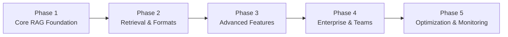
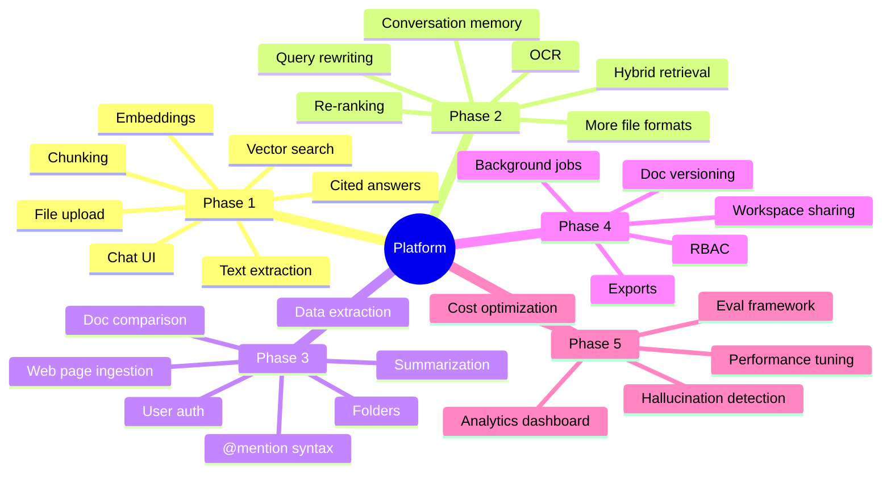

# AI-Powered Enterprise Knowledge Intelligence Platform

## Phase-Wise Implementation Plan

---

## Overview

The project is split into **5 phases**, each building on the previous one. Every phase ends with a working, demo-able product. Features that don't affect core functionality are intentionally pushed to later phases.

---

## Phase 1 — Core RAG Foundation

> **Goal:** Get the end-to-end pipeline working. A user uploads a document, asks a question, and gets a cited answer.

This is the backbone of the entire platform. Nothing else should be built until this works reliably.

---

### 1.1 Document Upload

- Accept file uploads from the user (PDF, DOCX, TXT to start)
- Store uploaded files on the server or cloud storage
- Display upload status and file list in the UI

### 1.2 Document Processing Pipeline

- Extract raw text from uploaded files
- Split text into smaller chunks (chunking strategy)
- Attach basic metadata to each chunk (file name, page number, chunk index)

### 1.3 Embedding & Vector Storage

- Generate vector embeddings for each chunk using an embedding model
- Store embeddings in Pinecone (vector database)
- Map each vector back to its source chunk and metadata

### 1.4 Question Answering

- Accept a natural language question from the user
- Convert the question into an embedding
- Search Pinecone for the most relevant chunks (semantic search)
- Pass retrieved chunks + question to an LLM to generate an answer

### 1.5 Source Citations

- Display the source document name and page number alongside every answer
- Show the exact excerpt that the answer was based on

### 1.6 Basic Chat UI

- Simple chat interface (question input + answer display)
- File upload panel
- Streaming response support (answers appear word by word)

---

### Phase 1 Deliverable

A working single-user document chatbot. Upload a PDF, ask questions, get cited answers in real time.

---

## Phase 2 — Retrieval Quality & Multi-Format Support

> **Goal:** Make the system smarter about finding the right content, and support more document types.

Phase 1 retrieval is purely semantic. This phase makes it significantly more accurate.

---

### 2.1 Hybrid Retrieval

- Add keyword-based search (BM25) alongside vector search
- Combine scores from both methods to rank results
- This improves results for exact-match queries (names, dates, codes)

### 2.2 Re-Ranking

- After initial retrieval, re-rank the top results using a cross-encoder model
- Only the highest-quality chunks are passed to the LLM
- Reduces irrelevant context and improves answer accuracy

### 2.3 Query Rewriting

- Before searching, rewrite the user's question into a better search query
- Handles vague or conversational questions like _"what about the penalty clause?"_

### 2.4 Additional File Formats

- **PPTX** — extract text from slide content and speaker notes
- **XLSX / CSV** — extract tabular data, preserve structure
- **Scanned PDFs and images** — run OCR to extract text from image-based documents
- **Table extraction** — detect and preserve tables as structured content

### 2.5 Conversation Memory

- Remember previous messages within a chat session
- Allow follow-up questions like _"what did that clause say again?"_
- Maintain a conversation history that is passed to the LLM with each query

### 2.6 Duplicate Detection

- Detect and skip duplicate or near-duplicate chunks during ingestion
- Prevent the same content from appearing multiple times in search results

---

### Phase 2 Deliverable

A meaningfully smarter system that handles more file types and gives better answers, especially on complex or multi-part questions.

---

## Phase 3 — Advanced Features & User Accounts

> **Goal:** Add the features that make this a knowledge assistant, not just a search tool. Add user accounts and document organization.

---

### 3.1 Document Summarization

- Generate an executive summary for any uploaded document
- Generate section-level summaries
- Extract key insights, action items, and bullet-point takeaways

### 3.2 Cross-Document Comparison

- Allow the user to select two or more documents to compare
- Highlight similarities, differences, and missing sections
- Useful for comparing contracts, policy versions, or research papers

### 3.3 Structured Data Extraction

- Extract specific fields from documents: dates, names, monetary values, clauses
- Allow users to define custom fields to extract
- Export extracted data as JSON, CSV, or Excel

### 3.4 `@mention` Context Targeting

- Parse `@document` and `@url` mentions in the chat input
- When a mention is detected, restrict retrieval to only that source
- Examples:
  - `Summarize @Annual_Report_2024.pdf`
  - `Compare @Contract_A.pdf and @Contract_B.pdf`
  - `Answer using @https://company.com/policy`

### 3.5 Web Page Ingestion

- Accept a URL as input
- Fetch and extract text content from the web page
- Index it alongside uploaded documents so users can query it

### 3.6 User Authentication

- User registration and login
- Secure sessions and password handling
- Each user sees only their own documents

### 3.7 Folder & Workspace Management

- Users can create folders to organize documents
- Group documents by project, client, or topic
- Basic search/filter by folder or document name

---

### Phase 3 Deliverable

A full-featured knowledge assistant with user accounts, document organization, and powerful analysis capabilities.

---

## Phase 4 — Enterprise Features & Team Collaboration

> **Goal:** Make the platform usable by teams, not just individuals. Add access control, versioning, and export capabilities.

---

### 4.1 Role-Based Access Control (RBAC)

- Define roles: Admin, Editor, Viewer
- Admins can manage users and documents
- Viewers can query but not upload or delete
- Restrict access to specific folders or workspaces per role

### 4.2 Workspace Sharing

- Users can invite team members to a shared workspace
- Shared workspaces have their own document collections
- Activity is visible to all members of the workspace

### 4.3 Document Versioning

- Upload a new version of an existing document
- Keep a version history with timestamps
- Compare two versions to see what changed
- Users can reference a specific version in queries

### 4.4 Export & Reporting

- Export answers, summaries, and comparisons as:
  - **PDF** — formatted report
  - **Markdown** — for documentation tools
  - **CSV / JSON** — for structured extraction results
- Generate a full report from a multi-document analysis session

### 4.5 Background Processing

- Process large documents asynchronously (don't block the UI)
- Show a progress indicator during ingestion
- Notify users when a document is ready to query
- Retry failed jobs automatically

---

### Phase 4 Deliverable

A team-ready platform with access control, shared workspaces, document versioning, and exportable reports.

---

## Phase 5 — Optimization & Observability

> **Goal:** Make the platform production-grade. Measure quality, reduce costs, and add monitoring.

This phase is built last because it requires real usage data and a stable system to optimize against.

---

### 5.1 Evaluation Framework

- Measure retrieval quality: Precision@K, Recall@K
- Check answer groundedness (does the answer actually come from the retrieved chunks?)
- Detect hallucinations (LLM claims not supported by source documents)
- Run A/B tests on different retrieval or prompting strategies

### 5.2 Cost Optimization

- Cache embeddings for chunks that haven't changed (avoid re-embedding)
- Incremental indexing — only process new or updated documents
- Detect and skip duplicate documents at upload time
- Select cheaper models for simpler queries dynamically

### 5.3 Observability & Analytics

- Track token usage per query and per user
- Log retrieval scores to identify weak retrieval cases
- Monitor error rates, latency, and uptime
- Collect user feedback (thumbs up/down on answers)
- Dashboard to review usage trends and quality metrics

### 5.4 Performance Improvements

- Add Redis caching for frequent queries
- Optimize chunk size and overlap based on eval results
- Tune re-ranking thresholds based on real data

---

### Phase 5 Deliverable

A production-ready platform with quality measurement, cost controls, and a monitoring dashboard.

---

## Full Feature Map

---

## Key Principles

- **Each phase produces a working product.** Nothing is left half-built at a phase boundary.
- **Core functionality first.** Auth, versioning, and monitoring are real features, but they don't affect whether the RAG pipeline works correctly.
- **Complexity is earned.** Re-ranking, hybrid retrieval, and evals are only useful once basic retrieval is working.
- **Later phases need earlier ones.** You can't optimize what you haven't built, and you can't evaluate a system that doesn't exist yet.
