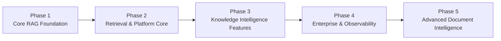
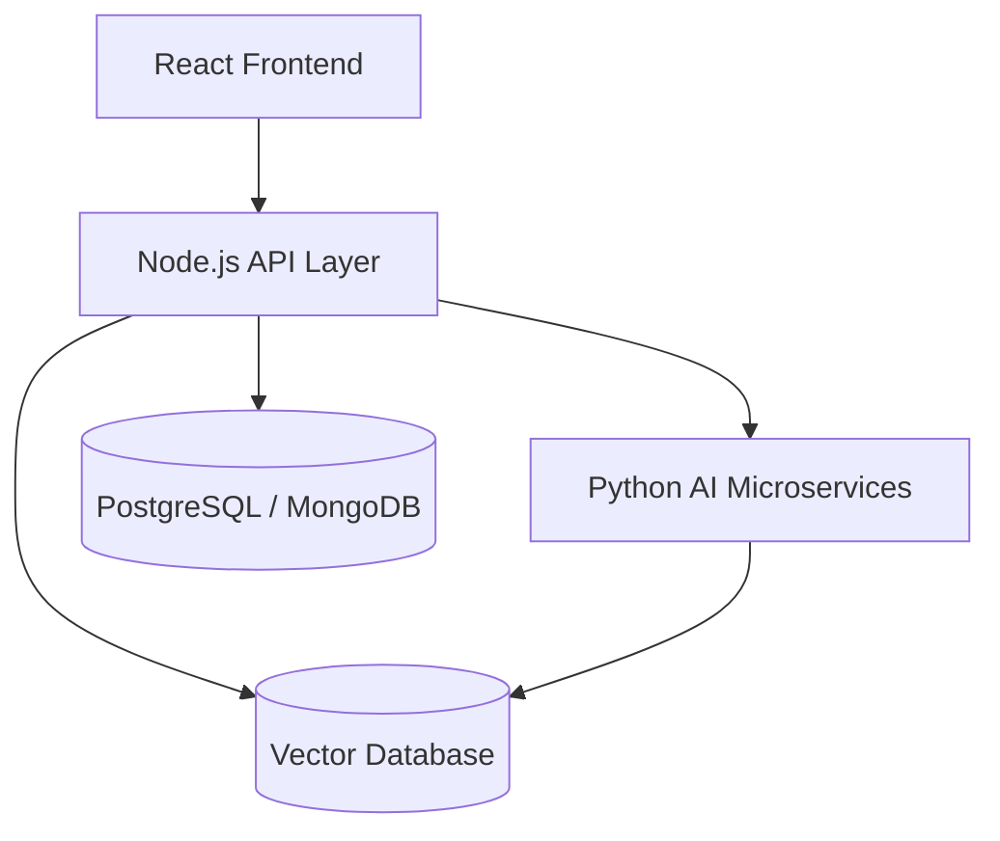
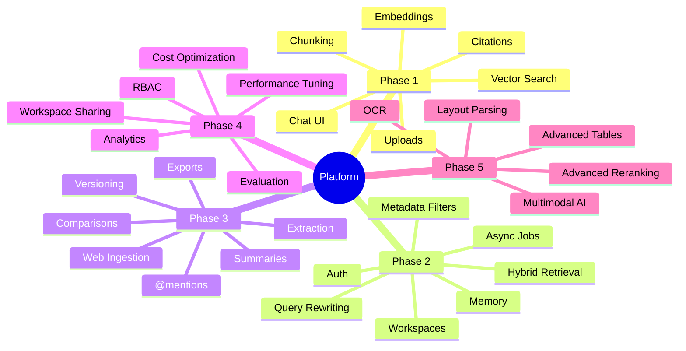

# AI-Powered Enterprise Knowledge Intelligence Platform

# Revised Phase-Wise Implementation Plan

---

# Overview

The project is intentionally designed in progressive layers.

The first phases focus on building a complete, polished, production-style RAG platform entirely in Node.js. Advanced OCR, layout-aware parsing, and heavy AI document intelligence are intentionally delayed to a dedicated later phase.

This approach:

- Keeps development realistic and finishable
- Maximizes resume value early
- Avoids getting stuck in OCR/parsing complexity
- Produces a working product after every phase
- Allows Python microservices to be added later without major refactoring

---

# Core Architectural Strategy

## Primary Stack (Initial Development)

- React frontend
- Node.js + Express backend
- LangChain JS
- Gemini models
- Pinecone / pgvector
- PostgreSQL or MongoDB
- Redis (later phases)

## Future AI Upgrade Layer

Python microservices are intentionally postponed until later phases.

Python will eventually handle:

- Advanced OCR
- Scanned document understanding
- Table extraction
- Layout-aware parsing
- Advanced reranking
- Advanced NLP pipelines
- Multimodal document intelligence

---

# Phase 1 — Core RAG Foundation

> Goal: Build the complete end-to-end RAG pipeline. A user uploads a document, asks a question, and receives a grounded answer with citations.

This phase establishes the backbone of the platform.

---

## 1.1 Document Upload

- Upload PDF, DOCX, and TXT files
- Store uploaded files locally or in cloud storage
- Show upload progress and uploaded document list

---

## 1.2 Document Processing Pipeline

- Extract raw text from uploaded files
- Perform chunking
- Attach metadata:
  - file name
  - page number
  - chunk index
  - upload timestamp

---

## 1.3 Embedding & Vector Storage

- Generate embeddings for chunks
- Store embeddings in Pinecone
- Map vectors back to source chunks
- Store metadata for retrieval and citations

---

## 1.4 Conversational Question Answering

- Accept natural language questions
- Generate query embeddings
- Retrieve relevant chunks from Pinecone
- Send retrieved context to Gemini
- Generate grounded answers

---

## 1.5 Source Citations

- Display document source
- Display page number
- Display supporting excerpts
- Highlight matched chunk text

---

## 1.6 Basic Chat UI

- Chat interface
- Upload panel
- Streaming responses
- Chat history display

---

## Phase 1 Deliverable

A working single-user RAG chatbot capable of answering questions over uploaded documents with citations.

---

# Phase 2 — Retrieval & Platform Core

> Goal: Improve retrieval quality and transform the prototype into a real multi-user platform.

This phase focuses on strong Node.js-first RAG engineering.

---

## 2.1 Hybrid Retrieval

- Combine:
  - semantic vector search
  - keyword/BM25 search

- Merge and rank results
- Improve exact-match retrieval performance

---

## 2.2 Metadata Filtering

Allow filtering retrieval by:

- document
- folder
- tags
- upload date
- author
- workspace

---

## 2.3 Query Rewriting

- Rewrite conversational questions into retrieval-optimized queries
- Improve vague or ambiguous searches

Examples:

- “What did the agreement say about penalties?”
- “Summarize the latest policy changes”

---

## 2.4 Conversation Memory

- Maintain session-based chat memory
- Support follow-up questions
- Store chat history per conversation
- Add memory summarization to reduce token growth

---

## 2.5 Additional File Formats

Add support for:

- PPTX
- XLSX
- CSV

Focus only on:

- text extraction
- simple table extraction
- metadata extraction

Advanced OCR and layout-aware parsing are intentionally postponed.

---

## 2.6 Duplicate Detection

- Detect duplicate documents
- Detect duplicate chunks
- Prevent repeated embeddings
- Reduce retrieval noise

---

## 2.7 User Authentication

- User registration/login
- Secure password storage
- JWT/session authentication
- User-level document isolation

---

## 2.8 Folder & Workspace Management

- Create folders
- Organize documents
- Basic workspace support
- Folder-based filtering

---

## 2.9 Background Processing

- Asynchronous ingestion jobs
- Upload queue system
- Progress tracking
- Retry failed ingestion jobs

---

## Phase 2 Deliverable

A strong multi-user RAG platform with significantly improved retrieval quality, document organization, async ingestion, and scalable architecture.

---

# Phase 3 — Knowledge Intelligence Features

> Goal: Add advanced AI-powered knowledge workflows that make the platform more than just a search system.

This phase focuses on high-value product intelligence features that are still realistic in Node.js.

---

## 3.1 Document Summarization

- Executive summaries
- Section summaries
- Key insights
- Bullet-point takeaways
- Action item extraction

---

## 3.2 Cross-Document Comparison

- Compare multiple documents
- Highlight:
  - similarities
  - differences
  - missing sections
  - changed clauses

Useful for:

- contracts
- reports
- policies
- specifications

---

## 3.3 Structured Data Extraction

Extract:

- names
- dates
- metrics
- monetary values
- clauses
- entities

Export results as:

- JSON
- CSV
- Excel

---

## 3.4 @mention Context Targeting

Support:

- @document
- @url

Examples:

- Summarize @Annual_Report_2025.pdf
- Compare @Contract_A.pdf and @Contract_B.pdf
- Answer using @[https://company.com/policy](https://company.com/policy)

Retrieval becomes restricted to selected sources.

---

## 3.5 Web Page Ingestion

- Accept URLs
- Extract web content
- Clean HTML
- Index web content alongside uploaded documents

---

## 3.6 Document Versioning

- Upload updated versions
- Track version history
- Compare versions
- Reference specific document versions

---

## 3.7 Export & Reporting

Export:

- summaries
- answers
- comparisons
- structured extraction results

Supported formats:

- PDF
- Markdown
- CSV
- JSON

---

## Phase 3 Deliverable

A production-style AI knowledge assistant with advanced analysis workflows, structured extraction, comparison capabilities, and document intelligence features.

---

# Phase 4 — Enterprise Features & Observability

> Goal: Add production-grade engineering maturity, team collaboration, monitoring, and optimization.

This phase focuses heavily on architecture, scalability, and operational quality.

---

## 4.1 Role-Based Access Control (RBAC)

Roles:

- Admin
- Editor
- Viewer

Support:

- workspace-level permissions
- folder-level permissions
- restricted document access

---

## 4.2 Workspace Sharing

- Invite team members
- Shared workspaces
- Shared document collections
- Team activity visibility

---

## 4.3 Evaluation Framework

Track:

- Precision@K
- Recall@K
- retrieval quality
- groundedness
- latency benchmarks
- hallucination estimation

Add A/B testing for:

- prompts
- retrieval strategies
- ranking strategies

---

## 4.4 Observability & Analytics

Track:

- token usage
- retrieval scores
- latency
- errors
- query analytics
- user feedback

Add dashboards for:

- usage trends
- retrieval failures
- cost monitoring

---

## 4.5 Cost Optimization

- embedding caching
- incremental indexing
- duplicate prevention
- dynamic model selection
- retrieval caching

---

## 4.6 Performance Optimization

- Redis caching
- optimized chunking
- retrieval tuning
- prompt optimization
- context compression
- streaming optimizations

---

## Phase 4 Deliverable

A scalable enterprise-ready RAG platform with collaboration, monitoring, evaluation, optimization, and production-grade operational tooling.

---

# Phase 5 — Advanced Document Intelligence (Python Upgrade Layer)

> Goal: Upgrade the ingestion and AI pipeline using Python microservices for advanced document intelligence.

This phase is intentionally separated because it introduces significant ML/NLP complexity.

The existing Node.js platform remains the main application layer.

Python services are introduced only for AI-heavy document processing.

---

# Proposed Architecture

---

## 5.1 Advanced OCR

Add support for:

- scanned PDFs
- image-based documents
- noisy scans
- rotated documents
- handwritten text

Possible future tools:

- Tesseract
- PaddleOCR
- EasyOCR
- DocTR

---

## 5.2 Layout-Aware Parsing

Improve understanding of:

- headers
- footers
- columns
- forms
- tables
- nested layouts
- section hierarchies

---

## 5.3 Advanced Table Extraction

- Preserve table structure
- Extract relational table data
- Detect merged cells and headers
- Improve spreadsheet understanding

---

## 5.4 Advanced Reranking Pipelines

Add:

- cross-encoder rerankers
- transformer reranking models
- semantic relevance scoring

Possible future tools:

- sentence-transformers
- BGE rerankers
- Cohere rerank

---

## 5.5 Advanced Chunking & Retrieval

- semantic chunking
- structure-aware chunking
- parent-child retrieval improvements
- layout-aware chunking
- retrieval compression

---

## 5.6 Multimodal Document Intelligence

Future support for:

- image understanding
- chart understanding
- diagram extraction
- visual document reasoning

---

## Phase 5 Deliverable

A production-grade enterprise document intelligence platform with advanced OCR, layout-aware parsing, sophisticated retrieval pipelines, and multimodal AI capabilities.

---

# Full Feature Map

---

# Key Principles

- Every phase must produce a usable, demoable product
- Node.js-first development keeps the platform realistic and finishable
- Python is introduced only where it provides major practical advantages
- Retrieval quality matters more than adding excessive AI complexity early
- Product polish and architecture quality matter more than experimental ML features
- Finishable systems are more valuable than overengineered prototypes
- Complexity should be introduced gradually and intentionally
