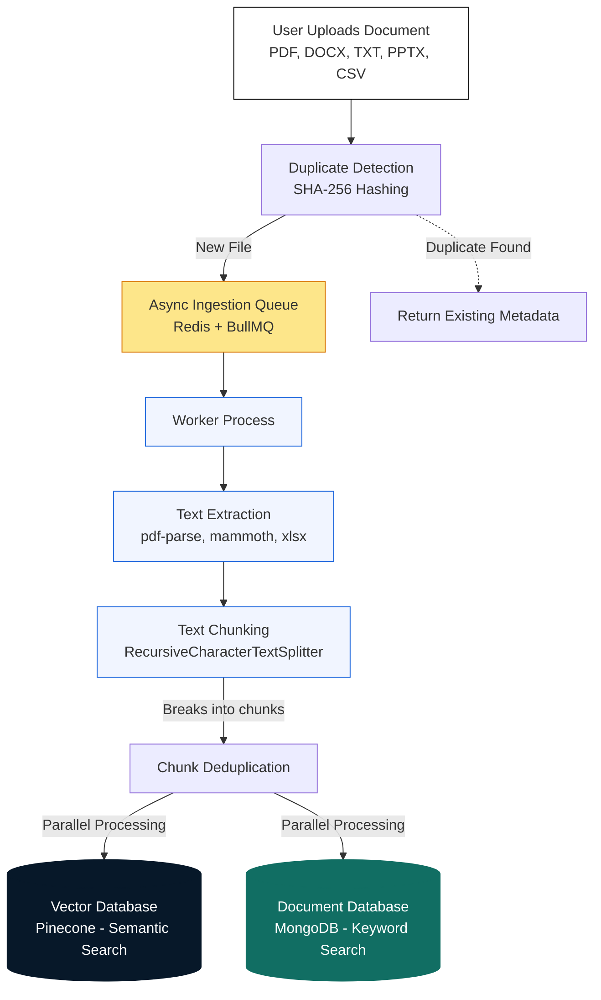
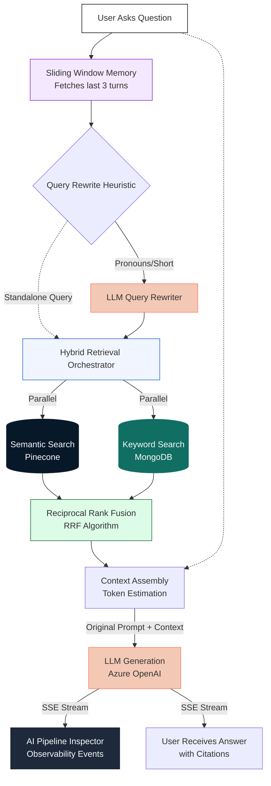

# RAG Pipeline Architecture

This document serves as the living architecture diagram for our Retrieval-Augmented Generation (RAG) pipeline. It outlines exactly what happens to your data from the moment a document is uploaded to the moment an AI response is generated.

This document has been updated to reflect the **Phase 2 Architecture**, which introduces enterprise-grade features like asynchronous ingestion, hybrid retrieval, and real-time observability.

---

## Phase 2 Architecture

### 1. Data Ingestion Pipeline (Upload)

When a user uploads a document, it goes through a resilient, asynchronous transformation process to become mathematically and textually searchable.

**Step-by-Step Breakdown:**
1. **Duplicate Detection:** The uploaded file is hashed (SHA-256) to check if it already exists in the workspace. If it does, processing is skipped to save costs and avoid duplicate chunks.
2. **Queuing:** The file is pushed to a background Redis queue (managed by BullMQ). This ensures the frontend doesn't timeout while processing large files.
3. **Extraction & Chunking:** A background worker picks up the job, extracts text across various formats, and splits it into semantic chunks.
4. **Dual Storage:** The chunks are simultaneously embedded and stored in **Pinecone** for semantic vector search, and stored in **MongoDB** with a text index for exact keyword matching.

---

### 2. Retrieval & Generation Pipeline (Chat)

When a user asks a question, the system employs sliding-window memory, LLM-based query rewriting, and hybrid retrieval with Reciprocal Rank Fusion (RRF) to provide the most accurate answer possible.

**Step-by-Step Breakdown:**
1. **Memory & Rewriting:** We pull the last 6 messages (3 conversational turns) from MongoDB. If the user's question contains pronouns (e.g., "What about the second one?"), an LLM strictly rewrites it into a standalone query. If the query is already standalone, we hit a fast-path heuristic to skip the LLM rewrite step and save latency.
2. **Hybrid Retrieval:** The standalone query is sent to both Pinecone (for meaning-based search) and MongoDB (for exact keyword/BM25-style search) concurrently.
3. **Reciprocal Rank Fusion (RRF):** Because vector scores and keyword scores operate on totally different mathematical scales, we use RRF to merge and rerank the two lists of chunks into a single definitive context list.
4. **Context & Generation:** The fused context is compiled with the *original* query and system instructions to prevent the LLM from hallucinating based on the memory or rewritten query.
5. **Streaming & Observability:** The LLM begins streaming the final answer to the user. Concurrently, the backend emits structured `pipeline_step` events (e.g., `query_rewritten`, `semantic_search_completed`, `context_compiled`) down the same SSE stream, which powers the real-time **AI Pipeline Inspector** panel for developers.
